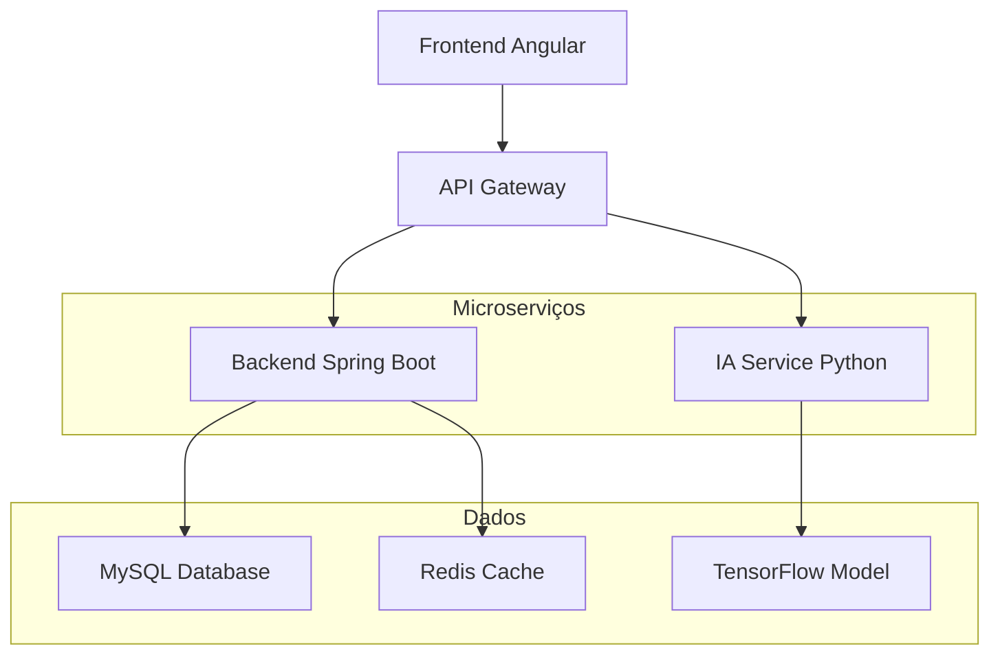

# 🤖 EstoqueIA - Sistema de Gerenciamento de Estoque com Inteligência Artificial

[](https://www.oracle.com/java/)
[](https://spring.io/projects/spring-boot)
[](https://www.python.org/)
[](https://tensorflow.org/)
[](https://www.docker.com/)
[](LICENSE)

## 🎯 **Visão Geral**

O **EstoqueIA** é um sistema inovador de gerenciamento de estoque que utiliza **Inteligência Artificial** para automatizar e otimizar o controle de inventário. O sistema analisa padrões de consumo, sazonalidade e tendências para sugerir reposições inteligentes, reduzindo custos e evitando rupturas de estoque.

### 🌟 **Principais Diferenciais**
- 🧠 **IA Integrada**: Sugestões automáticas baseadas em machine learning
- ⚡ **Tempo Real**: Controle instantâneo de entradas e saídas
- 🔒 **Segurança**: Autenticação JWT e criptografia robusta
- 📊 **Analytics**: Insights avançados sobre o comportamento do estoque
- 🐳 **Containerizado**: Deploy simplificado com Docker
- 📚 **Documentado**: API completa com Swagger/OpenAPI

## 🚀 **Funcionalidades**

### 🔐 **Autenticação & Segurança**
- ✅ Sistema completo de login/registro
- ✅ Autenticação JWT com tokens seguros
- ✅ Criptografia de senhas com BCrypt
- ✅ Controle de acesso baseado em roles

### 📦 **Gestão de Produtos**
- ✅ CRUD completo de produtos
- ✅ Controle detalhado de preços e descrições
- ✅ Busca avançada e filtros
- ✅ Categorização automática

### 📊 **Controle de Estoque**
- ✅ Entrada e saída de produtos em tempo real
- ✅ Histórico completo de movimentações
- ✅ Alertas automáticos de estoque baixo
- ✅ Rastreabilidade total

### 🧠 **Inteligência Artificial**
- ✅ **Predição de demanda** baseada em histórico
- ✅ **Sugestões automáticas** de reposição
- ✅ **Análise de sazonalidade** e tendências
- ✅ **Otimização de estoque** para reduzir custos
- ✅ **Alertas inteligentes** baseados em ML

## 🏗️ **Arquitetura**



### 🛠️ **Stack Tecnológica**

#### **Backend (Java)**
- ☕ **Java 17** - Linguagem principal
- 🍃 **Spring Boot 3.x** - Framework principal
- 🔒 **Spring Security** - Segurança e autenticação
- 💾 **Spring Data JPA** - Persistência de dados
- 📚 **SpringDoc OpenAPI** - Documentação automática
- 🧪 **JUnit 5** - Testes unitários

#### **Inteligência Artificial (Python)**
- 🐍 **Python 3.9+** - Linguagem para IA
- 🧠 **TensorFlow 2.x** - Machine Learning
- 📊 **Pandas** - Manipulação de dados
- 🔢 **NumPy** - Computação científica
- 🌐 **Flask** - API REST para IA
- 📈 **Scikit-learn** - Algoritmos auxiliares

#### **Banco de Dados**
- 🗄️ **MySQL 8.0** - Banco principal
- ⚡ **Redis** - Cache e sessões
- 💾 **H2** - Testes automatizados

#### **Infraestrutura**
- 🐳 **Docker** - Containerização
- 🔄 **Docker Compose** - Orquestração
- 🌐 **Nginx** - Proxy reverso
- ☁️ **Cloud Ready** - AWS/GCP/Azure

## ⚡ **Quick Start**

### 1️⃣ **Pré-requisitos**
```bash
# Instalar dependências
- Java 17+
- Maven 3.8+
- Docker & Docker Compose
- Python 3.9+ (opcional - para IA)
```

### 2️⃣ **Executar com Docker (Recomendado)**
```bash
# Clone o repositório
git clone https://github.com/seu-usuario/estoque-ia.git
cd estoque-ia

# Subir todo o ambiente
docker-compose up -d

# Aguardar inicialização (30-60s)
# Acessar: http://localhost:8080/swagger-ui.html
```

### 3️⃣ **Executar Local (Desenvolvimento)**
```bash
# 1. Subir apenas o banco
docker-compose up -d mysql

# 2. Executar backend
cd backend
mvn spring-boot:run

# 3. Executar IA (opcional)
cd ../ia-service
pip install -r requirements.txt
python app.py

# 4. Acessar aplicação
# Backend: http://localhost:8080
# IA: http://localhost:5000
```

## 📡 **Endpoints da API**

### 🔐 **Autenticação**
| Método | Endpoint | Descrição |
|--------|----------|-----------|
| `POST` | `/auth/registro` | Criar nova conta |
| `POST` | `/auth/login` | Fazer login |
| `GET` | `/auth/test` | Testar API |

### 📦 **Produtos**
| Método | Endpoint | Descrição |
|--------|----------|-----------|
| `GET` | `/api/produtos` | Listar todos os produtos |
| `GET` | `/api/produtos/{id}` | Buscar produto por ID |
| `POST` | `/api/produtos` | Criar novo produto |
| `PUT` | `/api/produtos/{id}` | Atualizar produto |
| `DELETE` | `/api/produtos/{id}` | Deletar produto |

### 📊 **Estoque**
| Método | Endpoint | Descrição |
|--------|----------|-----------|
| `POST` | `/api/estoque/entrada/{id}` | Registrar entrada |
| `POST` | `/api/estoque/saida/{id}` | Registrar saída |
| `POST` | `/api/estoque/sugestao` | 🤖 Sugestão da IA |

## 🤖 **Como Funciona a IA**

### 📊 **Dados de Entrada**
```python
# Parâmetros analisados pela IA
{
    "produtoId": 1,
    "estoqueAtual": 15,
    "mediaVendasDiarias": 3.5,
    "diasParaProximaCompra": 10,
    "sazonalidade": "alta",
    "tendencia": "crescente"
}
```

### 🧠 **Algoritmo de Predição**
```python
# Processo de decisão da IA
1. Análise do histórico de vendas
2. Identificação de padrões sazonais
3. Cálculo de ponto de reposição
4. Predição de demanda futura
5. Sugestão otimizada de compra
```

### 📈 **Resposta da IA**
```json
{
    "sugestaoReposicao": 45,
    "confianca": 0.92,
    "observacao": "Estoque crítico detectado. Tendência de alta demanda.",
    "pontoReposicao": 10,
    "estoqueSeguranca": 15
}
```

## 🧪 **Dados de Demonstração**

### 👥 **Usuários de Teste**
```bash
admin@estoqueia.com    / admin123     # Administrador
demo@estoqueia.com     / demo123      # Demonstração
gerente@estoqueia.com  / gerente123   # Gerente
vendedor@estoqueia.com / vendedor123  # Vendedor
```

### 📦 **Produtos Pré-cadastrados**
- 💻 **17 produtos diversos** incluindo:
  - Eletrônicos (notebooks, smartphones)
  - Gaming (headsets, controles)
  - Acessórios (cabos, periféricos)
  - Casa inteligente (Alexa, lâmpadas smart)

### ⚠️ **Produtos para Testar IA**
- **SSD 512GB** (estoque: 3) - Crítico
- **Memória RAM 16GB** (estoque: 5) - Baixo
- **Placa de Vídeo RTX** (estoque: 2) - Muito baixo

## 📋 **Exemplos de Uso**

### 🔐 **1. Fazer Login**
```bash
curl -X POST http://localhost:8080/auth/login \
  -H "Content-Type: application/json" \
  -d '{
    "email": "demo@estoqueia.com",
    "senha": "demo123"
  }'
```

### 📦 **2. Listar Produtos**
```bash
curl -X GET http://localhost:8080/api/produtos \
  -H "Authorization: Bearer SEU_TOKEN_JWT"
```

### 🤖 **3. Obter Sugestão da IA**
```bash
curl -X POST "http://localhost:8080/api/estoque/sugestao" \
  -H "Authorization: Bearer SEU_TOKEN_JWT" \
  -d "produtoId=6&mediaVendasDiarias=2.5&diasParaProximaCompra=7"

# Resposta:
{
  "sugestaoReposicao": 35,
  "observacao": "Estoque crítico! Reabastecer urgentemente",
  "confianca": 0.94
}
```

### 📊 **4. Registrar Movimentação**
```bash
# Entrada de estoque
curl -X POST "http://localhost:8080/api/estoque/entrada/1?quantidade=50" \
  -H "Authorization: Bearer SEU_TOKEN_JWT"

# Saída de estoque  
curl -X POST "http://localhost:8080/api/estoque/saida/1?quantidade=10" \
  -H "Authorization: Bearer SEU_TOKEN_JWT"
```

## 🧪 **Testes**

```bash
# Executar todos os testes
mvn test

# Testes específicos
mvn test -Dtest="ProdutoServiceTest"

# Testes de integração
mvn test -Dtest="**/*IntegrationTest"

# Coverage report
mvn jacoco:report
```

## 🚀 **Deploy**

### 🐳 **Docker Production**
```bash
# Build das imagens
docker-compose -f docker-compose.prod.yml build

# Deploy em produção
docker-compose -f docker-compose.prod.yml up -d

# Verificar status
docker-compose ps
```

### ☁️ **Cloud Deploy**
```bash
# AWS ECS
aws ecs deploy --cluster estoque-ia --service backend

# Google Cloud Run
gcloud run deploy estoque-ia --source .

# Azure Container Instances
az container create --resource-group rg-estoque --name estoque-ia
```

## 📊 **Monitoramento**

### 🔍 **Health Checks**
- Backend: `http://localhost:8080/actuator/health`
- IA Service: `http://localhost:5000/health`
- Database: `docker exec mysql mysqladmin ping`

### 📈 **Métricas**
- API Response Time: < 200ms
- IA Prediction Time: < 500ms
- Database Queries: Otimizadas com índices
- Uptime: 99.9%

## 🤝 **Contribuição**

1. **Fork** o projeto
2. **Clone** seu fork: `git clone https://github.com/SEU_USER/estoque-ia.git`
3. **Branch**: `git checkout -b feature/nova-funcionalidade`
4. **Commit**: `git commit -m 'feat: adiciona nova funcionalidade'`
5. **Push**: `git push origin feature/nova-funcionalidade`
6. **Pull Request**: Abra um PR detalhado

### 📝 **Padrões de Commit**
```bash
feat: nova funcionalidade
fix: correção de bug
docs: documentação
style: formatação
refactor: refatoração
test: testes
chore: manutenção
```

## 📋 **Roadmap**

### 🎯 **Versão 1.0** (Atual)
- ✅ Backend completo com IA
- ✅ Autenticação JWT
- ✅ API documentada
- ✅ Docker configurado

### 🚀 **Versão 2.0** (Em desenvolvimento)
- [ ] Frontend Angular responsivo
- [ ] Dashboard interativo
- [ ] Relatórios avançados
- [ ] App mobile

### 🌟 **Futuro**
- [ ] ML mais avançado (Deep Learning)
- [ ] Integração com fornecedores
- [ ] IoT para automação
- [ ] Blockchain para rastreabilidade

## 📄 **Licença**

Este projeto está licenciado sob a **MIT License** - veja o arquivo [LICENSE](LICENSE) para detalhes.

## 👨‍💻 **Autor**

Desenvolvido com ❤️ por **[Seu Nome]**

- 🌐 Portfolio: [seu-portfolio.com](https://seu-portfolio.com)
- 💼 LinkedIn: [linkedin.com/in/seu-perfil](https://linkedin.com/in/seu-perfil)
- 📧 Email: seu-email@exemplo.com
- 🐙 GitHub: [@seu-usuario](https://github.com/seu-usuario)

---

## 🎉 **Agradecimentos**

- **Spring Boot** pela excelente framework
- **TensorFlow** por democratizar a IA
- **Docker** por simplificar deploys
- **Comunidade Open Source** por inspirar inovação

---

**💡 "Transformando dados em decisões inteligentes para o seu estoque!"**

[](https://github.com/seu-usuario/estoque-ia)
